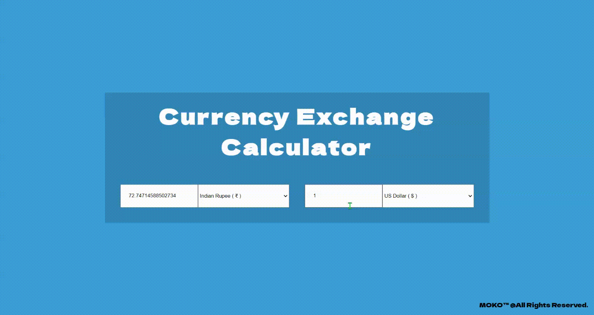

# CURRENCY EXCHANGE RATE  CALCULATOR

## DEMO 



## TECHNOLOGY USED

- React
- Axios

## API

https://api.coingecko.com/api/v3/exchange_rates

## HOW CURRENCY CONVERSION WORKS

```
InputCurrency * (exchangeRateOFOTher/exchangeRateOfGivenCurrency)
```

ex - Kim has $30000 CAD tha she wants to convert to USD. How much will she recieve in USD?

exchange rate =  1USD = 1.31 CAD

- 30000 CAD * 1/1.31 CAD
- 22,900.76 USD

## Important details

- Each currency has some value. The lower the currency value, the higher its actual value.
- USD currency value is 57626.78 at the time of writing this - 30 - 03 - 2021
- Indian Currency value is 4191981.473.
- As the USD has lesser currency value, its worth much higher than that of indian.
- so 1USD = 72.7RS

Fiat - Govt issued currency that is not backed by a commodity.

